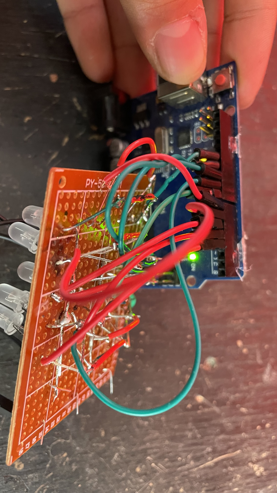

# red-green status board

a 5x3 grid of bi-color leds that can show different animations. built with an arduino and some patience soldering leds to perfboard. uses multiplexing so you dont need 30 pins to control 15 bi-color leds.



demo video:
[](https://www.youtube.com/watch?v=y9h3R71Xfdk)

## wiring

```
        col0   col1   col2
         a0     a1     a2
          |      |      |
          v      v      v
row0 12g--[led]--[led]--[led]
      3r--[led]--[led]--[led]

row1 11g--[led]--[led]--[led]
      4r--[led]--[led]--[led]

row2 10g--[led]--[led]--[led]
      5r--[led]--[led]--[led]

row3  9g--[led]--[led]--[led]
      6r--[led]--[led]--[led]

row4  8g--[led]--[led]--[led]
      7r--[led]--[led]--[led]

to light an led:
1. set the row pin high (pins 3-7 for red, 8-12 for green)
2. set the column pin low
3. current flows through the led
```

the leds are bi-color with a common cathode, so red and green share the same ground connection but have separate anode pins.

## how it works

the grid is wired so that 3 column pins (a0, a1, a2) and 10 row pins (3-12) can control all 15 leds. each led has a red element and a green element that can be controlled separately. the arduino rapidly scans through each column, lighting up the right leds for a few hundred microseconds before moving to the next column. it happens fast enough that your eyes see all the leds on at once.

this is called multiplexing and it saves a ton of pins - direct control would need 30 pins instead of 13.

## the animations

**focus_light** - simple red/green status light. press the button on pin 13 to toggle between red and green. good for a focus indicator for family etc

**rain** - random drops falling down the grid. each drop spawns randomly and is colored either red or green.

**snake** - a snake with a red head and green body moving around the perimeter of the grid.

**socratica** - displays the letters s-o-c-r-a-t-i-c-a one at a time in alternating red and green.

**test** - currently just another snake sketch.

## building one yourself

1. solder 15 bi-color leds to perfboard in a 5x3 grid
2. wire the columns together (3 wires total)
3. wire the red elements in rows (5 wires)
4. wire the green elements in rows (5 wires)
5. hook it up to an arduino following the pin mapping above
6. upload any sketch and watch it go

[bom here](bom.csv)

## things i learned

-   this was my first time using perfboard and doing multiplexing
-   c++ was rough at first but got easier as i went
-   i used the "wrong" side of the perfboard initially (oops)
-   some leds were backwards and had to be desoldered and flipped
-   charlieplexing exists and would use even fewer pins but multiplexing was simpler to understand

## future ideas

-   combine patterns with button controls to switch between them
-   add brightness adjustment
-   try charlieplexing to see how much more annoying it is
-   more complex animations maybe
